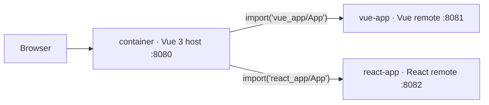

<div align="center">

# 🧩 micro-fe

**A micro-frontend proof of concept** — _one Vue host, two independently-built remotes (Vue + React), wired with Vite Module Federation._


A small experiment showing one way to compose a micro-frontend: a Vue 3 **container** lazy-loads two
independently-built remotes — a Vue remote and a React remote — at runtime via
[`@originjs/vite-plugin-federation`](https://github.com/originjs/vite-plugin-federation).

</div>

> ⚠️ **Demo only.** This is a learning proof of concept, not a production starter — no auth, no deploy
> pipeline, hardcoded `localhost` remote URLs.

---

- **Explore** — [What it is](#what-it-is) · [Quick start](#quick-start) · [How it's structured](#how-its-structured) · [Tech stack](#tech-stack)

---

## What it is

`micro-fe` demonstrates **runtime composition** of independently-built frontends. The Vue host
(*container*) owns routing; when you navigate to a remote route it dynamically imports a module
served by a separate app, even one written in a different framework (React). Each app builds and
runs on its own — they are stitched together only in the browser via Module Federation, not bundled
together at build time.

## Quick start

Requires **Node** and **[pnpm](https://pnpm.io/)** (the repo is a pnpm workspace).

```sh
pnpm install
pnpm start      # builds the remotes, then serves remotes + the host
pnpm stop       # frees the dev ports
```

Then open the container and use its nav to load each remote:

| App | Role | URL |
|---|---|---|
| container | Vue 3 host (owns routing) | <http://localhost:8080> |
| vue-app | Vue 3 remote, exposes `./App` | <http://localhost:8081> |
| react-app | React 18 remote, exposes `./App` | <http://localhost:8082> |

In the container, `/vue-app` and `/react-app` lazy-load the respective remote.

## How it's structured

A pnpm workspace with three packages — one host and two remotes:

```
.
├── container    # Vue 3 host — vue-router lazy-imports the remotes
├── vue-app      # Vue 3 remote — exposes ./App (vueApp.js)
└── react-app    # React 18 remote — exposes ./App (reactApp.js)
```



The host declares the remotes' entry files (`vueApp.js`, `reactApp.js`); each remote declares what it
`exposes`. `vue` is shared between the host and the Vue remote; `react`/`react-dom` are shared within
the React remote.

## Tech stack

| Layer | Tech |
|---|---|
| Host | Vue 3 + Vue Router + Pinia |
| Remotes | Vue 3 · React 18 |
| Build / dev | Vite 4 |
| Federation | `@originjs/vite-plugin-federation` |
| Language | TypeScript 5 |
| Workspace | pnpm workspace + `npm-run-all` |
